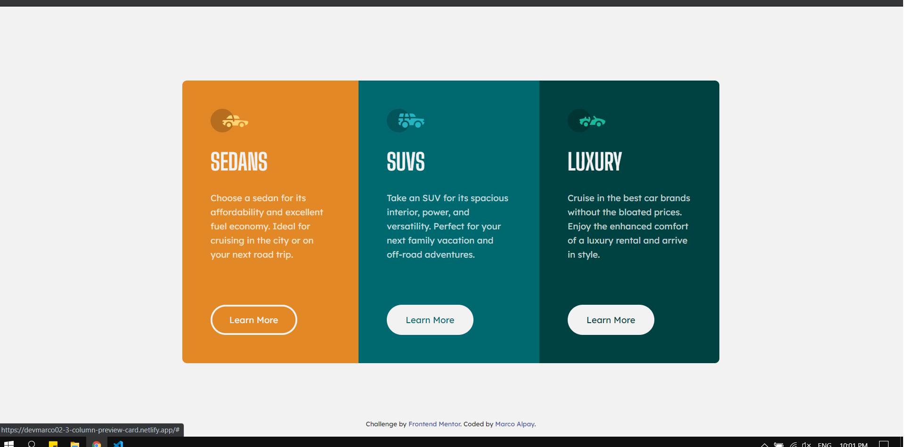

# Frontend Mentor - 3-column preview card component solution

This is a solution to the [3-column preview card component challenge on Frontend Mentor](https://www.frontendmentor.io/challenges/3column-preview-card-component-pH92eAR2-). Frontend Mentor challenges help you improve your coding skills by building realistic projects.

## Table of contents

- [Overview](#overview)
  - [The challenge](#the-challenge)
  - [Screenshot](#screenshot)
  - [Links](#links)
- [My process](#my-process)
  - [Built with](#built-with)
  - [What I learned](#what-i-learned)
- [Author](#author)

## Overview

### The challenge

Users should be able to:

- View the optimal layout depending on their device's screen size
- See hover states for interactive elements

### Screenshot




### Links

- Solution URL: [https://www.frontendmentor.io/solutions/3-column-preview-card-using-sass-E3jouq7m\_](https://www.frontendmentor.io/solutions/3-column-preview-card-using-sass-E3jouq7m_)
- Live Site URL: [https://devmarco02-3-column-preview-card.netlify.app/](https://devmarco02-3-column-preview-card.netlify.app/)

## My process

### Built with

- Semantic HTML5 markup
- Sass
- Flexbox
- Mobile-first workflow

### What I learned

I have learned how to use box-shadow property.

```css
a:hover {
    background-color: initial;
    box-shadow: inset 0 0 0 3px var(--very-light-gray);
    color: var(--very-light-gray);
  }
}
```

## Author

- Frontend Mentor - [@devMarco02](https://www.frontendmentor.io/profile/devMarco02)
